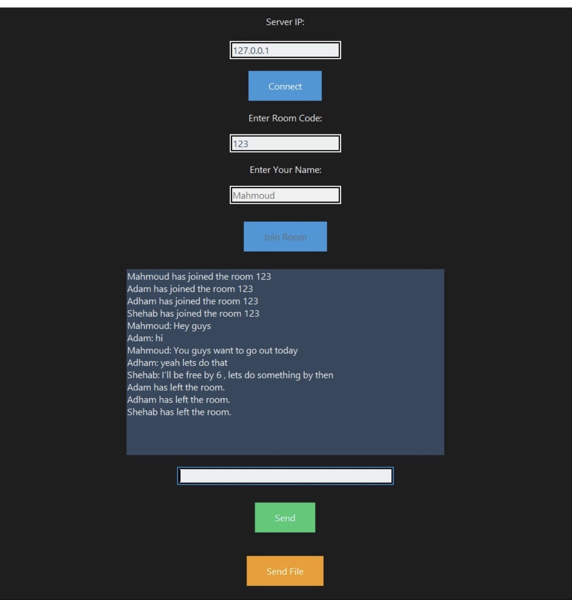

# Chat Room Application (Python)

## 📖 Overview
This is a real-time chat room application developed as part of the **Computer Networks** course during my 5th semester (third year).

It demonstrates practical implementation of **client–server communication** using **Python TCP sockets**, handling multiple clients, and a GUI-based client interface.

---

## ⚙️ Technologies Used
- Python
- TCP Sockets
- Client–Server Architecture
- Multithreading
- Tkinter (GUI)

---

## ✨ Features
- Real-time messaging between multiple clients
- Room-based communication using unique room codes
- File transfer between clients
- Threaded server handling multiple connections
- User-friendly graphical interface

---

## 🏗️ Architecture
- **Server (`server.py`)**
  - Handles client connections and communications
  - Manages chat rooms and messages
  - Uses threading for concurrency

- **Client (`client.py`)**
  - Connects to server using IP and room code
  - Allows sending/receiving messages
  - Supports file sharing

---

## 📸 Screenshots



## 🚀 How to Use

1. **Start the server**
```bash
python server.py

2. **Start the server**
```bash
python client.py

3. Enter the server IP as : 127.0.0.1 , room code of ur own, and your name.

4. Start chatting! 🎉
