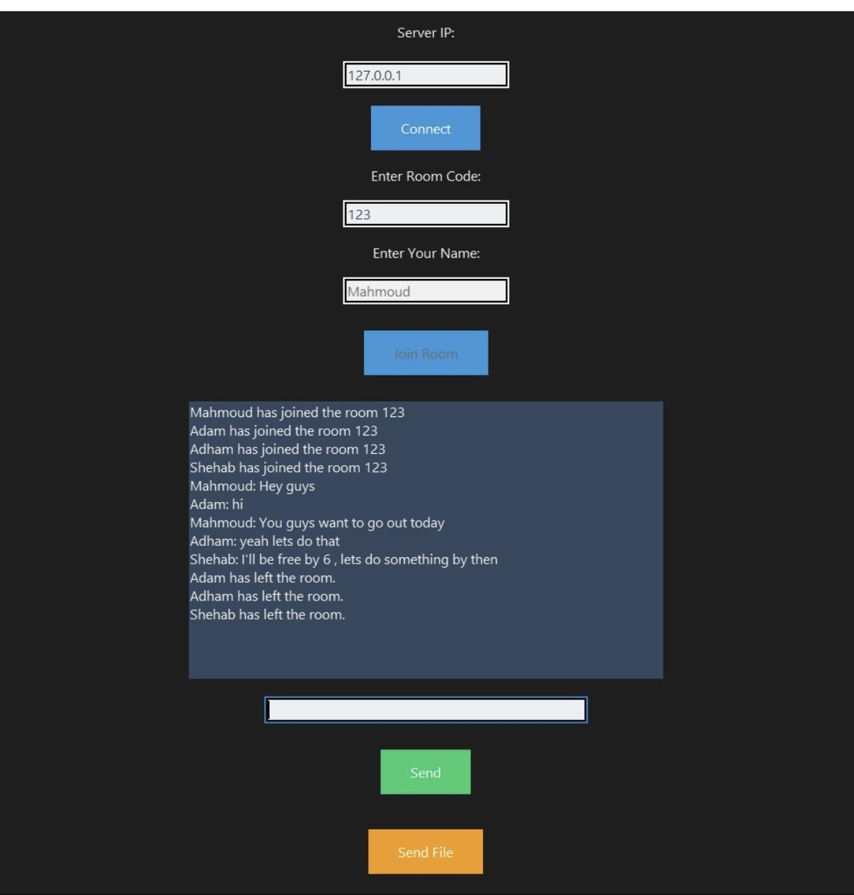

# Chat Room Application (Python)

## 📖 Overview
This is a real-time chat room application developed as part of the **Computer Networks** course during my 5th semester (third year).

It demonstrates practical implementation of **client–server communication** using **Python TCP sockets**, handling multiple clients, and a GUI-based client interface.

---

## 📸 Screenshots

### GUI


### Poster


---

## ⚙️ Technologies Used
- Python
- TCP Sockets
- Client–Server Architecture
- Multithreading
- Tkinter (GUI)

---

## ✨ Features
- Real-time messaging between multiple clients
- Room-based communication using unique room codes
- File transfer between clients
- Threaded server handling multiple connections
- User-friendly graphical interface

---

## 🏗️ Architecture

### Server (`server.py`)
- Handles client connections and communications
- Manages chat rooms and message broadcasting
- Uses threading for concurrency

### Client (`client.py`)
- GUI-based client application
- Connects to server using IP and room code
- Allows sending and receiving messages
- Supports file sharing

---

## 🚀 How to Run

### 1️⃣ Start the server
```bash
python server.py
```
### 2️⃣ Start one or more clients (in new terminals)
```bash
python client.py
```
### 3️⃣ Using the client GUI

- Server IP: `127.0.0.1`
- Room code: any code (e.g., `123`)
- Name: your name
- Click **Connect** → **Join Room** → start chatting 🎉

